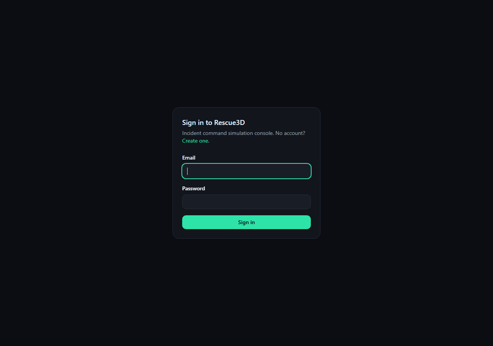
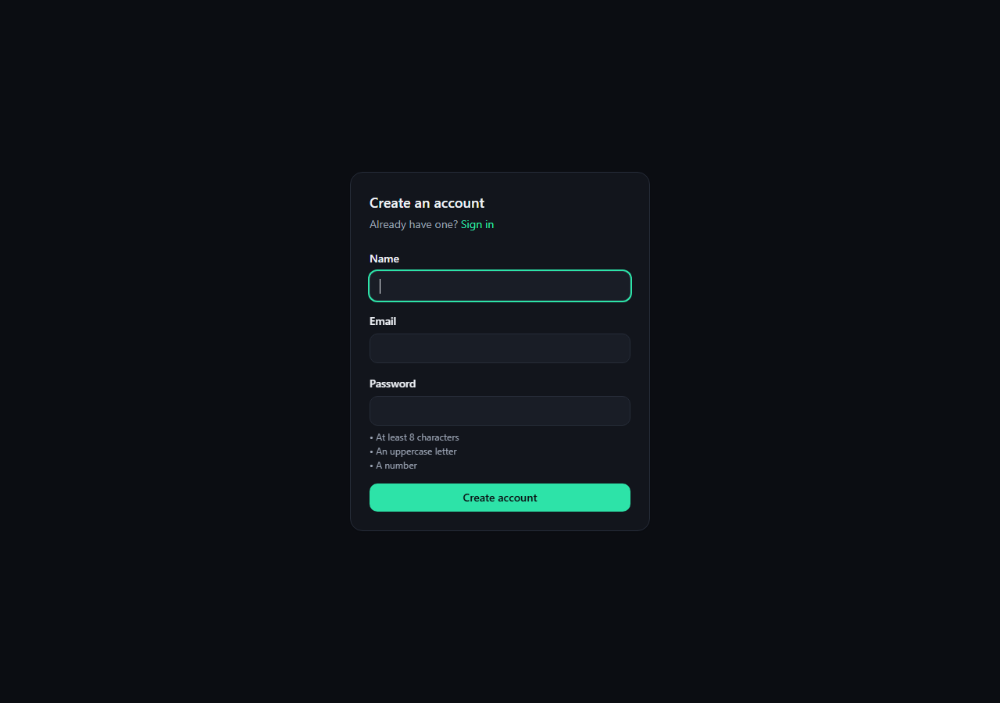

# Rescue3D

**Full title:** Rescue3D — A 3D Interactive Disaster Management and Emergency Response Simulator

Rescue3D is a web-based educational disaster-management simulator combining an interactive 3D city, disaster simulation, emergency-resource management, simulated safe-route planning, real-time rescue operations, analytics and reports.

> Rescue3D is an educational simulation. Routes, risk scores, resource recommendations and response times are simulated and must not be used for real emergency decisions.

## Team

| Name | GitHub | Role |
|---|---|---|
| Nilusha Madhuwanthi Jayasekara | [@nilushamadhuwanthi123](https://github.com/nilushamadhuwanthi123) | Full-Stack Product, Incident Intelligence and Emergency Response Lead |
| Kavindu Madhuhansa Liyanage | [@kavindu-maduhansa](https://github.com/kavindu-maduhansa) | 3D Simulation, Disaster Visualization and DevOps Lead |

See [docs/NILUSHA_SCOPE.md](docs/NILUSHA_SCOPE.md) and [docs/KAVINDU_SCOPE.md](docs/KAVINDU_SCOPE.md) for the full ownership split.

## Live

| | |
|---|---|
| App | https://nilushamadhuwanthi123.github.io/rescue3d-disaster-response-simulator/ |
| API health | https://rescue3d-api.onrender.com/api/health |

The API runs on Render's free tier, so the first request after a quiet period
wakes the service and can take up to a minute. That is the plan, not a fault.

## Screens

Captured from the deployed build.

### Nilusha — incident intelligence and emergency response

**Sign in**

[](docs/screenshots/sign-in.png)

**Create an account — the password rules are stated up front and tick off as you type**

[](docs/screenshots/sign-up.png)

Both forms validate against the same rules the API enforces, word for word, and
every server-side field error is shown under the input it belongs to rather than as
one message at the bottom. The rules themselves are pure functions in
`apps/web/src/lib/authValidation.ts`, covered by unit tests.

> The dashboard, incident command centre and analytics screens sit behind
> authentication, so they are not in this set yet — they need a signed-in
> session to capture.

## Stack

- **Frontend:** React, TypeScript, Vite, React Router, React Three Fiber / Three.js / Drei, Tailwind CSS, TanStack Query, Zustand, React Hook Form, Zod, Recharts, Framer Motion, Socket.IO Client
- **Backend:** Node.js, Express, TypeScript, MongoDB/Mongoose, Socket.IO, JWT auth, bcrypt, Zod validation, Swagger/OpenAPI, Helmet
- **Quality:** ESLint, Prettier, Vitest, React Testing Library, Supertest, Playwright, GitHub Actions, Docker Compose

## Monorepo layout

```
apps/
  web/        React + Three.js frontend
  api/        Express + MongoDB backend
packages/
  contracts/  Shared TypeScript types (API + 3D scene contracts)
  simulation-core/  Routing engine, recommendation engine, simulation logic
  ui/         Shared design-system components
  config/     Shared ESLint/TS config
docs/         Architecture, API, scope and integration documentation
```

## Getting started

```bash
nvm use
npm install
cp .env.example apps/api/.env
cp .env.example apps/web/.env
npm run dev:api
npm run dev:web
```

Requires a local or Docker MongoDB instance — see `docker-compose.yml`.

## Status

Deployed and running end to end: the React frontend on GitHub Pages against a
Node/Express API and MongoDB Atlas on Render. Auth, incident command, unit
dispatch, the simulated routing engine, the incident timeline, analytics and
the realtime channel are all live; the 3D city and disaster visualisation are
still being built.

This project is under active development. See [docs/BRANCH_AND_PR_HISTORY.md](docs/BRANCH_AND_PR_HISTORY.md) for what has actually been built and verified so far — this README will be kept in sync with real progress only.
